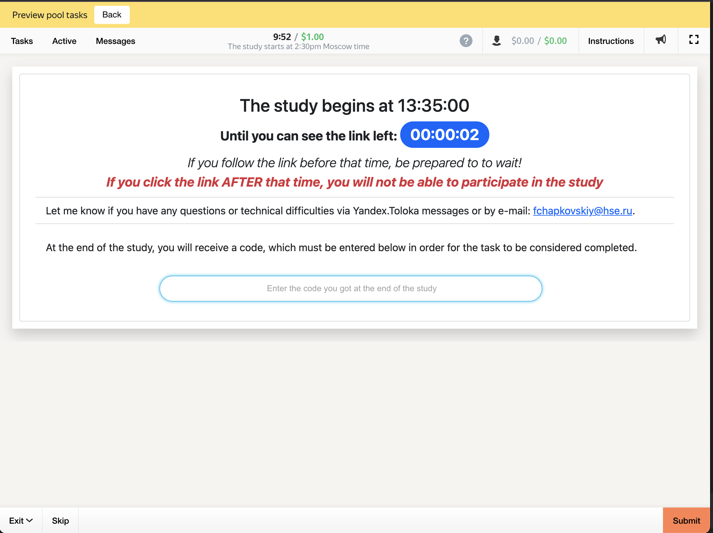

_Philipp Chapkovski_
# _"Interactive experiments in Toloka"_


# JS and HTML for integrating Toloka and oTree

The integration of oTree and Toloka in its essence consists in adding a toloka assignment id in a form of url query parameter to an url that user clicks to reach the running oTree server (that points to either a waiting room or active session). So let's assume that your oTree session link looks like:

```html
http://my-study-link.herokuapp.com/join/abcdefg
```
which is a standard format for session-wide links in oTree. The provided JavaScript (JS) code when a user accepts the assignment, will automatically add the current assignment id in a following format:
```html
http://my-study-link.herokuapp.com/join/abcdefg?participant_label=ASSIGNMENT_ID
```
where `ASSIGNMENT_ID` will be substituted with an actual assignment id. This will assigns the assignment id to a participant label on oTree server side. Using this id will allow to retrieve any information related this assignment, including user id. That allows to automatically process variable payoffs based on a participant decision, and pay them in a form of bonus.

## Project creation

When a new project is created, its interface for a final user (study participant) can be built either by using a combination of html, css and JavaScript, or using the Toloka interface builder specification ([see more here](https://toloka.ai/ru/docs/template-builder/index.html?lang=en)). The interface builder does not allow passing the assignment information to the external link, so in order to integrate Toloka with oTree, it is necessary to choose 'HTML/JS/CSS' option, and insert the corresponding files either from `standard` or `timed` subfolders to the corresponding sections  (content of `project.css` to 'css' section, content of `project.html` to `html` section, and content of `project.js` to `js` section.)


## Input and output fields

Toloka projects use a combination of templates (built with either interface builder or html), and input and output fields. The input fields are variable data that can vary from one study ('pool' in Toloka terminology) to another. They are injected in the template in the place where the field name in a corresponding place is used in curvy brackets. Thus if as an input field called `session_url` there is a link pointing to an active oTree session, and the completion code that confirms that participant indeed completed the study is collected as an output field `otree_code` the html may look like that:

```HTML
<div>
  Please click  <a href={{session_url}}>the following link</a> to start the study.
</div>

<div>
  {{field type="input" name="otree_code" placeholder="Please insert the completion code"}}
</div>

```
and the task file in a TSV (tab-separated values) format will look like that:

| INPUT:session_url|
| ----------- |
| https://toloka-games.herokuapp.com/join/u9r8ooqe0d/      |

(the examples of task files in TSV format for both standard and timed versions are provided in corresponding subfolders.)
The set of input and out fields are also available when the project is edited (see figure XXX).


The resulting task description before participant accepts it looks like that:


 It includes the task title, followed by its short description, amount paid as a participation fee, and how much they earn per hour (calculated by Toloka using the difference between time when the task was accepted and submitted). In addition participants can see how other participants rated this task (measured in 'stars' above the title). This rating is used to sort the tasks in the task feed for participants: tasks with a higher rating are shown before low-rated tasks.

The task screen using the html that is provided in this paper looks similar to Figure XXX. It includes the link, subsituted by the `session_url` with an assigment id added, and the output field. The task is counted as completed as soon as they fill in the returning code and click 'Submit' button


## Timed projects

Timed projects are similar to standard projects, with only one difference: in addition to the link that points to a running oTree server, the data specification contains an input field `start_time` that contains a specific  time when participants are allowed to click on the link and proceed with the study. The example of the task file is provided in `tasks/timed_tasks_example.tsv` and it looks like that:

|INPUT:start_time| INPUT:session_url|
| ----------- | ----------- |
|2022-01-05T13:35| https://toloka-games.herokuapp.com/room/toloka/    |

The start time is a timestamp in an ISO format (Year-Month-Day`T`Hour:Minute) and the time is fixed in Moscow time zone (GMT+3).
Since all the participants are able to join the session at the exact same time, it makes sense to use a room link rather than a link to a specific session. Read more about oTree rooms [here](https://otree.readthedocs.io/en/self/rooms.html).

The resulting task looks slightly differently before the time of study has come and after that. Before the study the counter is shown that shows how many minutes and seconds remain till the link to the study will be available (see Figure XXX). After the study the link is shown with the notification that participants should access it at the specific time (we do not limit those participants who access the link after this time, but we warn them that there is a chance that there will be no free slots available). Both before and after the timeout task screens are shown in Figures XXX and XXX correspondingly.



.

## External libraries.

To render both HTML and CSS correctly, both standard and timed projects rely on some external JS/CSS packages. They have to be linked to the project when you edit it (at the top of the HTML section, see Figure XXX below).

Only `toloka-handlebars-templates` is strictly required for running the project (and indeed this dependency is inserted automatically by Toloka itself when you create a new project). The rest ([jQuery](https://jquery.com/), [jQuery countdown](https://hilios.github.io/jQuery.countdown/) and [Bootstrap](https://getbootstrap.com/docs/5.0) CSS) is optional, and the project JS code can be easily re-written in a plain, 'vanilla' JavaScript.

.
